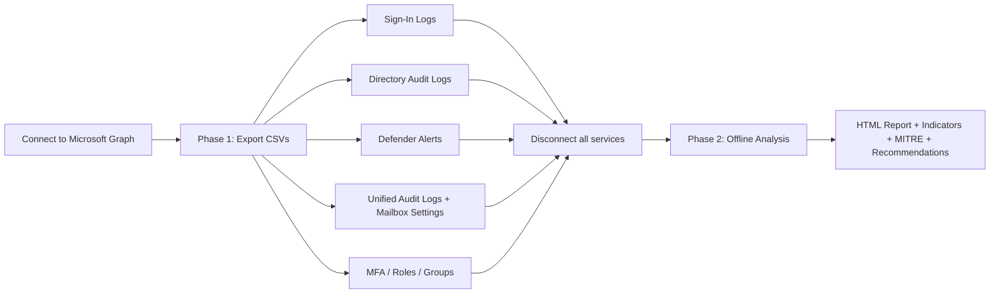

# Entra ID Account Insights

A PowerShell tool that analyzes Microsoft Entra ID (Azure AD) **sign-in logs**, **directory audit logs**, and **Microsoft 365 unified audit logs** to detect indicators of suspicious account activity. It exports the raw data to CSV and produces a rich, interactive **HTML report** with detection indicators mapped to the MITRE ATT&CK framework, along with prioritized security recommendations.

---

## Table of Contents

- [Overview](#overview)
- [Key Features](#key-features)
- [How It Works](#how-it-works)
- [Requirements](#requirements)
- [Required Permissions](#required-permissions)
- [Installation](#installation)
- [Usage](#usage)
- [Parameters](#parameters)
- [Configuration](#configuration)
- [Output Files](#output-files)
- [Detections](#detections)
- [Security & Privacy](#security--privacy)
- [Disclaimer](#disclaimer)

---

## Overview

The tool runs in **two phases**:

1. **Phase 1 – Export (online):** Connects to Microsoft Graph (and optionally Exchange Online / Security & Compliance) and exports sign-in logs, directory audit logs, Defender alerts, unified audit logs, MFA methods, mailbox settings, and role/group memberships to timestamped CSV files.
2. **Phase 2 – Analyze (offline):** Disconnects from all cloud services and analyzes the exported CSVs entirely offline, generating a single self-contained HTML report.

## Key Features

- 17 **sign-in** suspicious-behavior indicators (brute-force, password-spray, impossible travel, token theft, legacy auth, etc.).
- Multiple **audit** indicators (privileged role changes, OAuth consent, mailbox forwarding rules, CA policy modification, etc.).
- **Unified audit log** detections (mass file download, mass email deletion, MailItemsAccessed abuse).
- **Microsoft Defender** alert correlation for the analyzed user.
- **MITRE ATT&CK** technique mapping with an interactive matrix.
- Interactive, self-contained **HTML dashboard** (sidebar navigation, modals, CSV export per indicator, sortable tables, print-friendly).
- Prioritized **security recommendations** (Critical/High/Medium/Low) with licensing guidance.
- Optional **parallel analysis** on PowerShell 7+.

## How It Works



## Requirements

- **Windows PowerShell 5.1** or later (PowerShell 7+ recommended for `-ParallelAnalysis`).
- PowerShell modules (auto-installed if missing):
  - `Microsoft.Graph.Authentication`
  - `Microsoft.Graph.Reports`
  - `ExchangeOnlineManagement` (only needed for unified audit logs and mailbox settings)
- Permission to install modules for the current user (`Install-Module -Scope CurrentUser`).
- Network access to Microsoft Graph and, optionally, Exchange Online / Security & Compliance endpoints.

## Required Permissions

The script requests the following **delegated** Microsoft Graph scopes:

| Scope | Purpose |
|-------|---------|
| `AuditLog.Read.All` | Read sign-in and directory audit logs |
| `Directory.Read.All` | Resolve users, roles, and group memberships |
| `SecurityAlert.Read.All` | Read Microsoft Defender alerts |
| `UserAuthenticationMethod.Read.All` | Read the user's MFA authentication methods |

For **unified audit logs** and **mailbox settings**, the admin account also needs Exchange Online / Security & Compliance access (e.g., appropriate Exchange admin roles and audit-log search enabled).

## Installation

1. Download `EntraIDAccountInsights.ps1` to a local folder.
2. Open a PowerShell session.
3. If required, allow the script to run for the current session:
   ```powershell
   Set-ExecutionPolicy -Scope Process -ExecutionPolicy Bypass
   ```
4. Run the script (see [Usage](#usage)). Missing modules are installed automatically on first run.

## Usage

**Interactive (prompts for UPN, output folder, working hours, and days to search):**
```powershell
.\EntraIDAccountInsights.ps1
```

**Non-interactive with a date range:**
```powershell
.\EntraIDAccountInsights.ps1 -EntraIDAdmin admin@contoso.onmicrosoft.com `
    -UserToAnalyze user@contoso.com -Output C:\out `
    -StartDate '2025-12-01' -EndDate '2025-12-31'
```

**Flag off-hours activity outside a 09:00–17:00 working day:**
```powershell
.\EntraIDAccountInsights.ps1 -EntraIDAdmin admin@contoso.onmicrosoft.com `
    -UserToAnalyze user@contoso.com -Output C:\out `
    -StartTime '09:00' -EndTime '17:00' -Open
```

**Skip unified audit logs (faster, no Exchange/Compliance connection):**
```powershell
.\EntraIDAccountInsights.ps1 -UserToAnalyze user@contoso.com -Output C:\out -ExcludeUnifiedAudit
```

**Parallel analysis on PowerShell 7+:**
```powershell
pwsh .\EntraIDAccountInsights.ps1 -UserToAnalyze user@contoso.com -Output C:\out -ParallelAnalysis
```

## Parameters

| Parameter | Type | Description |
|-----------|------|-------------|
| `-Output` | string | Folder for exported CSVs and the HTML report. Prompted if omitted. |
| `-Open` | switch | Automatically open the HTML report when finished. |
| `-EntraIDAdmin` | string | UPN used for interactive Graph/Exchange authentication. |
| `-UserToAnalyze` | string | UPN of the target (affected) user. Prompted if omitted. |
| `-StartTime` | string | Start of working hours as `HH:mm` (e.g. `09:00`) for off-hours detection. Use with `-EndTime`. |
| `-EndTime` | string | End of working hours as `HH:mm` (e.g. `17:00`). Must differ from `-StartTime`. |
| `-StartDate` | string | Start of the log date-range filter (date string or Unix epoch seconds/ms). |
| `-EndDate` | string | End of the log date-range filter. |
| `-daysToSearch` | int | Number of days of history to retrieve (default `30`). |
| `-ExcludeUnifiedAudit` | switch | Skip unified audit log retrieval (no Exchange/Compliance connection). |
| `-ParallelAnalysis` | switch | Analyze sign-in/audit/unified logs concurrently (PowerShell 7+ only). |
| `-ConfigPath` | string | Path to a custom JSON config. Defaults to `default-config.json` beside the script. |
| `-LoadFunctionsOnly` | switch | Internal: dot-source functions without running the tool (used by parallel runspaces). |

> **Note:** Sign-in and Defender data respect `-daysToSearch` (no 30‑day cap). Directory audit logs are limited by tenant retention (typically up to 30 days).

## Output Files

All files are written to the `-Output` folder with a `yyyyMMdd_HHmmss` timestamp:

- `Signinlogs_<user>_<timestamp>.csv`
- `AzureAD_DirectoryAuditLogs_<user>_<timestamp>.csv`
- `DefenderAlerts_<user>_<timestamp>.csv`
- `UnifiedLogs_<user>_<timestamp>.csv` (+ EmailForwarding, InboxRules, JunkEmailConfiguration, MailboxProtocols, SendAs, FullAccess, MailItemsAccessed, EmailSendandDeleteEvents)
- `MFADetails_<user>_<timestamp>.csv`
- `RolesAndGroupsMembership_<user>_<timestamp>.csv`
- `Entra_ID_Account_Insights_Report_<timestamp>.html` – the final interactive report.

## Security & Privacy

- Uses Microsoft Graph SDK **interactive (delegated)** authentication; tokens are managed by the module and not stored in plaintext.
- All user input is validated (UPN format and output-path traversal checks).
- HTML output is encoded to mitigate XSS in the generated report.
- Secrets (e.g., MFA secret keys, Temporary Access Pass) are redacted in exports.
- **Exported CSV/HTML files may contain sensitive data** — review and handle them according to your organization's data-handling policy.

## Disclaimer

This tool supports security monitoring and initial triage only. Its indicators do **not** constitute a full incident investigation or a definitive determination of compromise. If potential indicators of compromise are identified, engage qualified SOC/security personnel for a comprehensive investigation and remediation. Use of this script is at your own risk; the author and contributors are not liable for any resulting damages.
